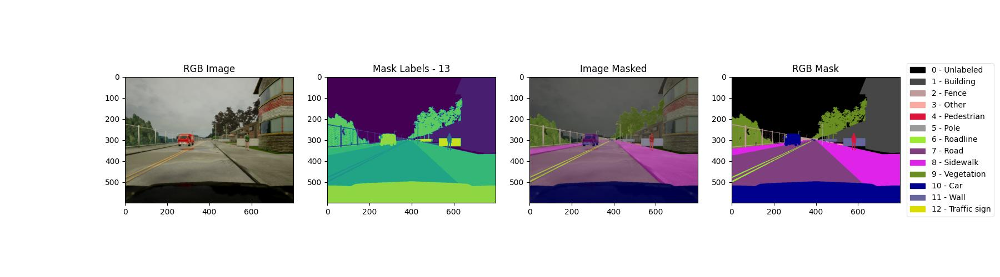
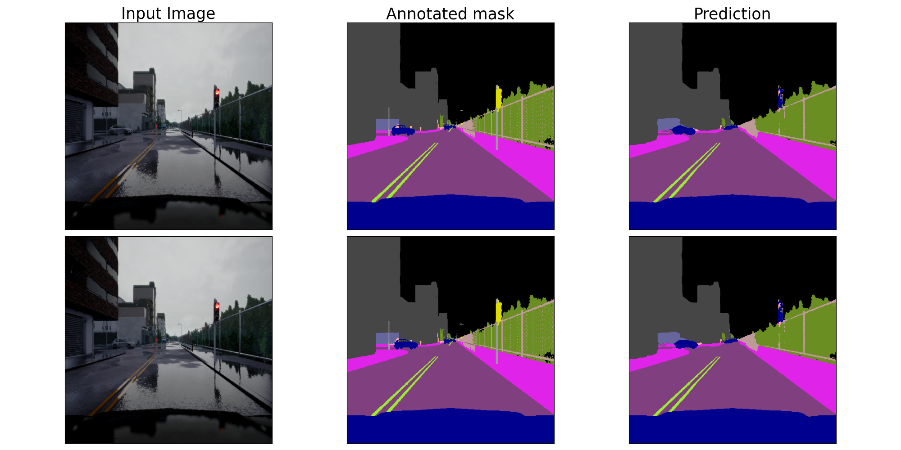
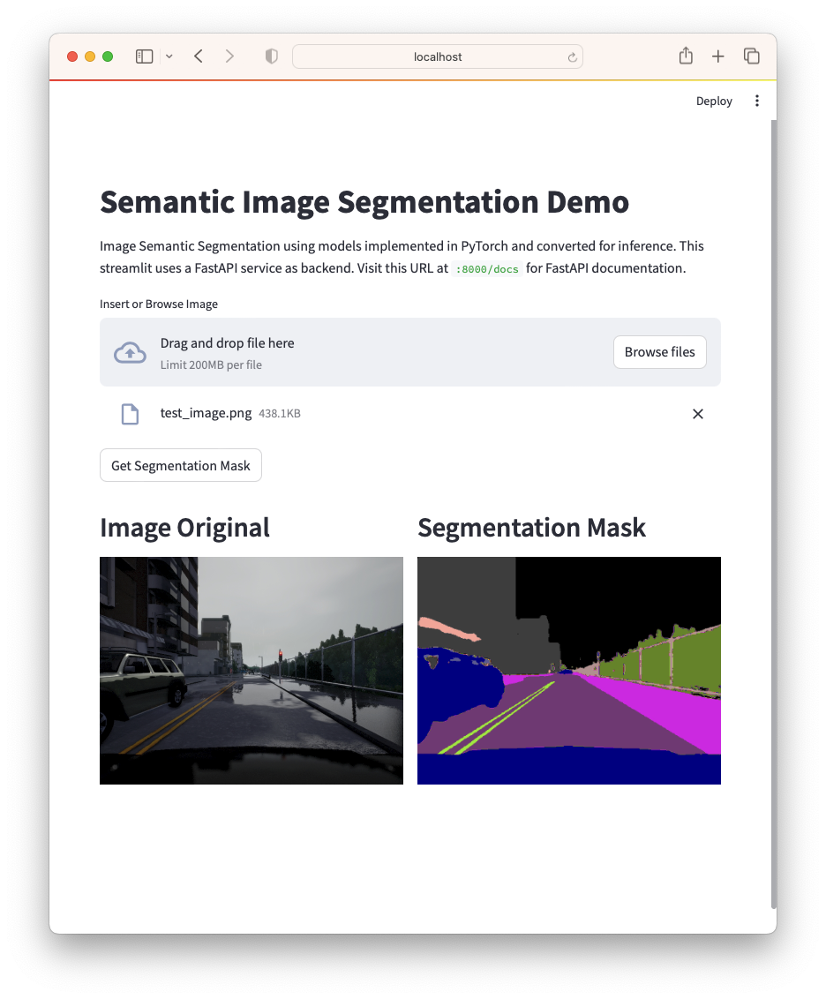

# Semantic Segmentation Task

This repository contains code for semantic segmentation using PyTorch. 
It includes tools for training, testing, inference, and a Model Serving FastAPI + Streamlit for interactive visualization.

## Dataset

Sourse: https://www.kaggle.com/datasets/kumaresanmanickavelu/lyft-udacity-challenge

Download and unzip to `data/` folder.

Dataset sample images:


### Context
This dataset provides data images and labeled semantic segmentations captured via CARLA self-driving car simulator. The data was generated as part of the Lyft Udacity Challenge. This dataset can be used to train ML algorithms to identify semantic segmentation of cars, roads etc in an image (13 classes).


## Installation

Follow these steps to set up your environment and install the necessary packages:

1. Clone this repository:

   ```
   git clone https://github.com/ederev/rb-segmentation.git
   cd rb-segmentation
   ```
2. Create and activate a virtual environment:

    ```
    python3 -m venv .venv
    source .venv/bin/activate 
    ```
    or via conda using environment.yaml
    ```
    conda env create -f environment.yml
    conda activate .venv
    ```
3. Install dependencies:
    ```
    pip install -r requirements.txt
    ```
## Training

To train a semantic segmentation model, run the following command:

```
python -m segmentation.train --config=configs/unet.yaml --project_path=outputs
```

where
- `--config` is the path to experiment config in configs/
- `--project_path` is the path for storing project artifacts (models, logs, checkpoints, visualizations, metrics, etc.)

As a result, torch model is saved and converted in formats for inference:`.pt`, `.pth`, `.onnx`.

Tensorboard logs visualization is also supported:
```
tensorboard --logdir outputs/<experiment-folder>/logs
```

Artifacts for 'UNet'+'timm-mobilenetv3_large_100' experiment - [DOWNLOAD LINK](https://drive.google.com/drive/folders/1OTRMlF6QIJFbP_5GIUNP-4UlAYq4c42P?usp=sharing) (place it in `outputs/` folder)

## Testing
Several tests for inference models are excecuted directly at the end of training process in `segmentation/train.py`.

Test sample image:


Also you can other tests to ensure the code is functioning correctly. Use the following command:
- inference on video feed using a pre-trained model
```
python -m segmentation.inference
```
- benchmarking CPU and GPU models
```
python -m segmentation.benchmark
```

## Model Serving FastAPI + Streamlit

Еxample Demo of usage of streamlit and FastAPI for ML torch.jit() serving.

Here semantic segmentation torch traced `model_traced.pt` is served sing `FastAPI` for the backend service and `streamlit` for the frontend service, 
`docker compose` orchestrates the two services and allows communication between them.

Make sure you have Docker installed.

To run the example in a machine running Docker and docker compose, run:
        
    docker compose build
    docker compose up
    

The FastAPI app will be available at http://localhost:8000, and the Streamlit UI at http://localhost:8501.

App demo screen:


For Documentation of FastAPI visit http://localhost:8000/docs.
